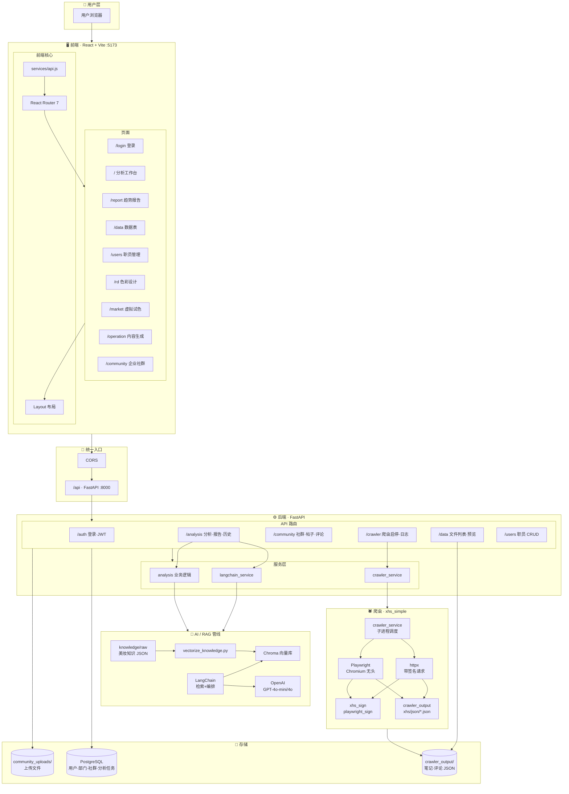
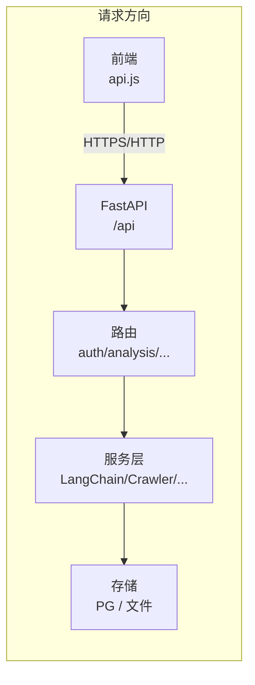
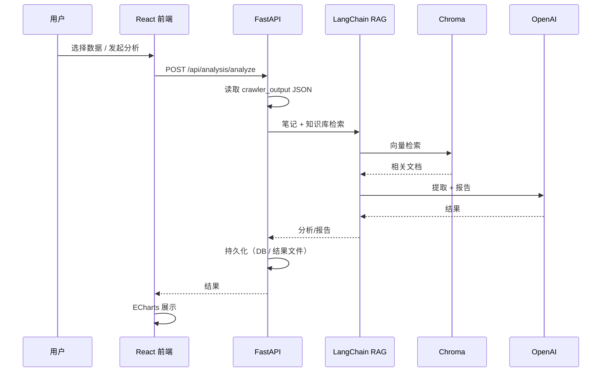
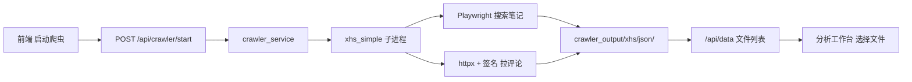
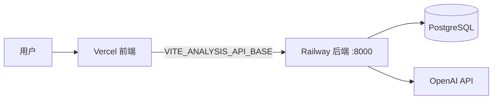

# D2C 口红实验室 - 系统架构

当前实际使用的架构，不含已废弃的 MediaCrawler、独立 8080 爬虫等。

---

## 1. 详细系统架构图

下图展示从用户到前端、后端、RAG、爬虫与存储的完整模块与依赖关系。可在 [Mermaid Live](https://mermaid.live) 或 VS Code（Mermaid 插件）中查看渲染效果。



### 数据流总览（请求从前端到存储）



---

## 2. 整体架构（简化）

```mermaid
flowchart TB
    subgraph Client["客户端"]
        SPA["React SPA (Vite :5173)"]
    end

    subgraph Backend["后端 FastAPI :8000"]
        API["REST /api"]
        Auth["auth"]
        Analysis["analysis"]
        Community["community"]
        Crawler["crawler"]
        Data["data"]
        Users["users"]
        API --> Auth & Analysis & Community & Crawler & Data & Users
    end

    subgraph AI["AI / RAG"]
        LC["LangChain"]
        Chroma["Chroma"]
        OpenAI["OpenAI"]
        LC --> Chroma & OpenAI
    end

    subgraph Storage["存储"]
        PG[("PostgreSQL")]
        Out["crawler_output/"]
        Uploads["community_uploads/"]
    end

    subgraph CrawlerProc["爬虫 xhs_simple"]
        Playwright["Playwright"]
        Httpx["httpx"]
        Sign["xhs_sign / playwright_sign"]
        Playwright --> Sign
        Httpx --> Sign
        CrawlerProc --> Out
    end

    SPA --> API
    Analysis --> LC
    Backend --> PG & Out & Uploads
    Crawler --> CrawlerProc
    Data --> Out
```

- 前端只连一个后端地址（8000），爬虫与分析共用该服务。
- 爬虫为 xhs_simple：Playwright 负责搜索与签名生成，httpx 负责带签名请求评论；结果写入 `backend/data/crawler_output/`。

---

## 3. 笔记分析数据流



---

## 4. 爬虫调用链



---

## 5. 部署架构（Railway + Vercel）



- Vercel：托管 frontend 静态资源（Vite build）。
- Railway：运行主后端（含 xhs_simple 爬虫），通过 `DATABASE_URL` 连 PostgreSQL。

---

## 6. 技术难点

### 6.1 爬虫与反爬（xhs_simple）

- **签名与风控**：小红书接口依赖前端生成的签名（如 x-s、x-t 等），算法混淆且常更新；需在 Playwright 里复现页面 JS（如 `window.mnsv2()`）或逆向为纯 Python（xhs_sign），并随平台更新维护。
- **稳定性**：Cookie 过期、限流、封 IP 会导致抓取失败，需要登录刷新、重试与限速策略，并对用户有明确提示。
- **进程模型**：Playwright 同步 API 与 FastAPI 的 asyncio 冲突，当前用**子进程**跑爬虫，进程间通过队列传日志/状态，设计与调试都比同进程异步复杂。

### 6.2 RAG 与 AI 管线

- **效果**：检索是否命中、Prompt 设计、模型选型（4o-mini / 4o）会直接影响分析质量与报告可读性；需反复调知识库切分、向量维度、Top-K 与提示词。
- **成本与延迟**：大量笔记 + 长上下文会拉高 Token 消耗与响应时间，需要摘要、分片、缓存或异步任务，避免超时与费用激增。
- **结构化输出**：让 LLM 稳定输出 JSON（如 ECharts 配置、报告结构）需要约束格式（schema、示例），并做解析失败时的降级或重试。

### 6.3 前后端与部署

- **跨域与鉴权**：生产环境需正确配置 CORS（如 `FRONTEND_ORIGIN`）与 JWT 校验，避免未授权访问与跨域报错。
- **环境差异**：本地与 Railway/Vercel 在端口、环境变量、文件系统（无持久盘）上不一致；爬虫在 Railway 上需 Playwright Chromium 及依赖，镜像体积与构建时间会上升。
- **前端体验**：分析/爬虫为长耗时操作，需轮询或 SSE（如 `/crawler/logs/stream`）展示进度与日志，并处理断网、刷新后的状态恢复。

### 6.4 数据与一致性

- **多源数据**：分析结果可能写 DB（分析任务、历史）与本地文件（如详细结果 JSON），需约定「哪份为准」、清理策略与备份方式。
- **大结果集**：报告、图表数据较大时，接口需分页或流式返回，避免单次响应过大导致超时或前端卡顿。

### 6.5 安全与合规

- **密钥**：`OPENAI_API_KEY`、`JWT_SECRET`、`DATABASE_URL` 不能进前端或日志，需用环境变量并在生产环境严格配置。
- **爬虫合规**：遵守目标站点 robots.txt 与使用条款，控制频率与用途，避免法律与伦理风险。
